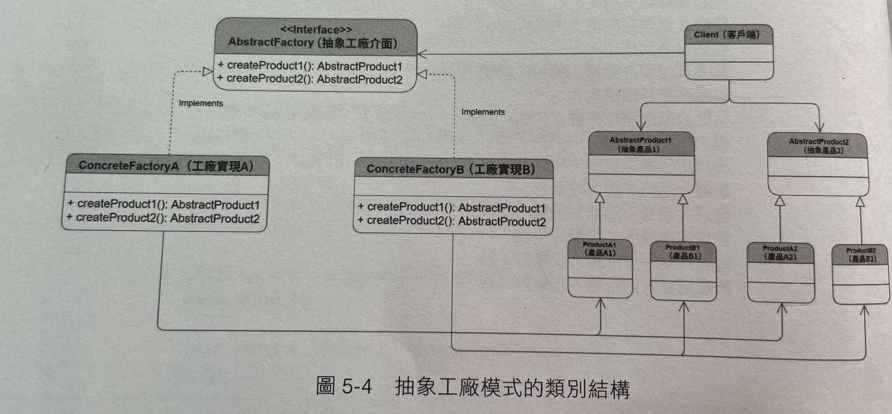

## Abstract Factory 抽象工廠

> 當產品具有多組相同性質的分類(品牌與系列)，可以用抽象工廠減少工廠的數量
> 抽象工廠又被稱為「工廠的工廠」

## 品牌與系列範例
- A品牌汽車工廠
  - 轎車生產線
  - 越野車生產線
  - 跑車生產線

- B品牌汽車工廠
  - 轎車生產線
  - 越野車生產線
  - 跑車生產線

---

- Excel5
  - Reader
  - Writer
- Excel2007
  - Reader
  - Writer
- ODS
  - Reader
  - Writer

## 類別結構

## 結論
- 情境：當產品具有多組相同性質的分類，可以用抽象工廠減少工廠的數量

## 其它參考資料

- [我的Notion筆記](https://iced-droplet-883.notion.site/Abstract-Factory-73a3a3f6622f46309e865783e29d4125)
- 參考書籍 ([秒懂設計模式](https://www.books.com.tw/products/0010910659))