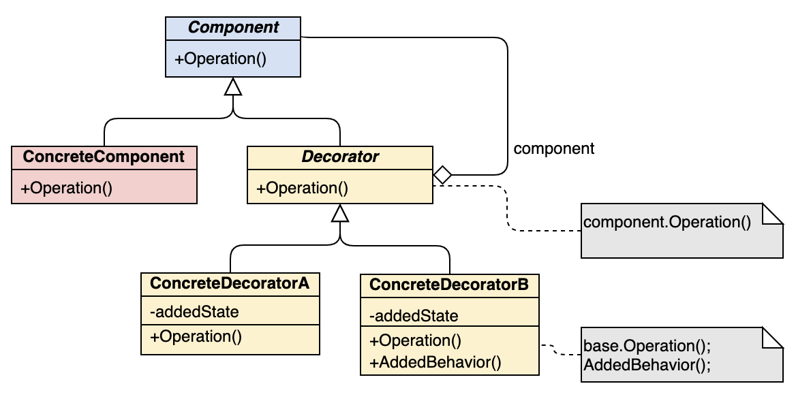

## Decorator 裝飾器模式

```
在「執行時」動態地為原始物件增加一些額外的功能，使其變得更加強大
```

- 情境：希望在執行時為物件新增額外的行為
- 優點：
  - 無需建立子類即可擴充物件的行為
  - 可以在執行時新增物件的功能
  - 可以用多個裝飾封裝物件來組合幾種行善
  - 裝飾類和被裝飾類可以獨立發展，不會互相耦合
- 缺點
  - 要刪除特定封裝器比較困難
  - 實現行為不受裝飾棧順序影響的裝飾比較困難 (行為將受到裝飾器套用順序影響)
  - 各層的初始化配置程式碼看上去可能會很糟糕

### 類別結構


- notion筆記
  - https://iced-droplet-883.notion.site/Decorator-12339944950d44f9b2e61acd02872295
- 其它參考資料 
  - [秒懂設計模式](https://www.books.com.tw/products/0010910659)
  - https://iter01.com/560870.html
