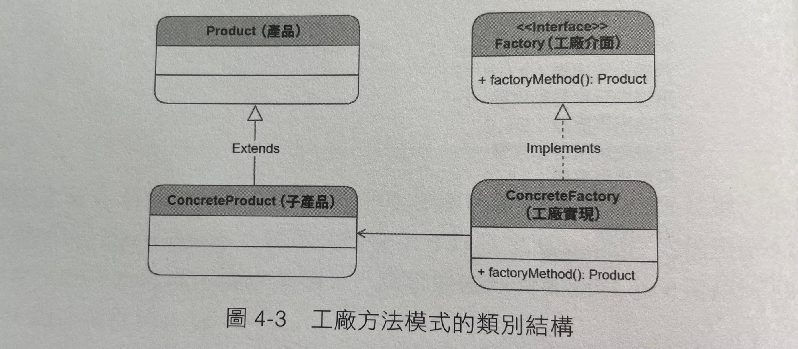

## Factory Method 工廠方法

> 可以視為考慮多型的簡單工廠，讓每個工廠專注在自己產品的生產

- 簡單工廠對物件的構造、實例化過程封裝，但不算是一種設計模式
- 工廠方法為考慮多型的簡單工廠，其核心思想為：
  - 工廠不必萬能(泡麵工廠不必生產汽車，手機工廠也不必生產牛仔褲，否則就會通而不精)
  - 每個工廠都應圍繞各自的產品進行生產，專注於自己的產品開發

## 類別結構

## 結論
- 情境：當有一多型物件需要生產時，可以用工廠方法模式
- 建議：個人認為實務上還是要斟酌選用簡單工廠或工廠方法
  - 如果物件的建立是很單純的，自己個人會覺得有時候簡單工廠還是比較方便

## 其它參考資料

- [我的Notion筆記](https://iced-droplet-883.notion.site/Factory-Method-b42504e252784b5ab21cfe92d3984eb0)
- 參考書籍 ([秒懂設計模式](https://www.books.com.tw/products/0010910659))