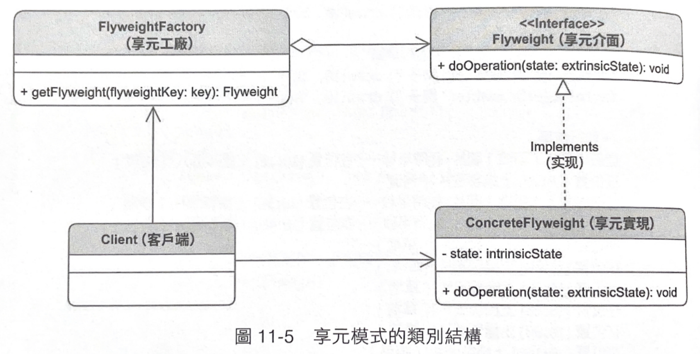

## Flyweight Factory 享元工廠

> 或稱輕量模式，利用快取的方式管理一群相同介面類別的工廠 
> 可以透過共享物件的方式節省記憶體開銷 (快取的原理) 

- 用快取的方式暫存一組相同介面的物件，讓取得這組物件時可以大幅降低記憶體的使用量和效能
- 實作主要核心重點有兩個
  - 利用 dictionary 來快取物件，並可以選擇要使用 eager loading 還是 lazy loading，一般使用 lazy loading
  - 實作的時候，決定哪些屬性是內部屬性，哪些是外部屬性
    - 內部屬性：每次使用該享元物件時，內部屬性都是一樣的
    - 外部署性：每次使用該享元物件時，外部屬性會使用不同的資料

  
## 享元模式與原型模式的不同

- 原型模式用複製的方式省去的物件初始化的過程，加快初始化的過程
- 享元模式
  - 利用共享物件的方式「降底記憶體的使用率」
  - 在第二次存取同樣的享元物件時，也省去了初始化的時間

## 類別結構

## 結論
- 情境：當有一多型物件需要生產時，可以用工廠方法模式
- 建議：個人認為實務上還是要斟酌選用簡單工廠或工廠方法
  - 如果物件的建立是很單純的，自己個人會覺得有時候簡單工廠還是比較方便

## 其它參考資料

- [我的Notion筆記](https://iced-droplet-883.notion.site/Factory-Method-b42504e252784b5ab21cfe92d3984eb0)
- 參考書籍 ([秒懂設計模式](https://www.books.com.tw/products/0010910659))