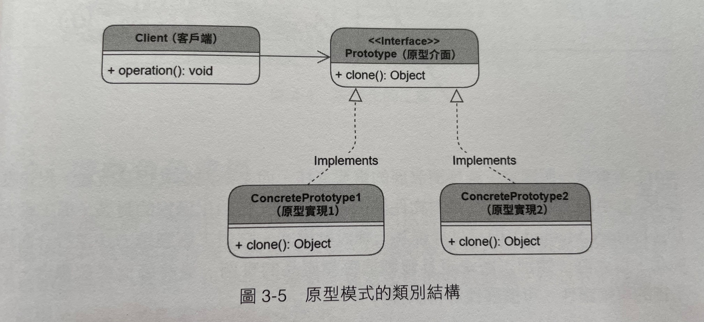

## Prototype 原型模式

`原型模式可以用物件建立物件，而不是用類別建立物件，以此達到效率的提升`

## 類別結構

## 結論
- 情境：當需要建立多個類似的複雜物件時，我們就可以考慮用原型模式
- 注意：
  - 用C#在實作這個模式時，發現如果類別本身是非常非常簡單的構造的時候，用prototype模式建立反而會比較花時間！
  - 所以決定使用此模式時，應該實際測試過使用prototype模式建立是否真的有提升效率！

## 其它參考資料

- [我的Notion筆記](https://iced-droplet-883.notion.site/Prototype-ce9766bfd0df4da99ff288810c78edcb)
- 參考書籍 ([秒懂設計模式](https://www.books.com.tw/products/0010910659))