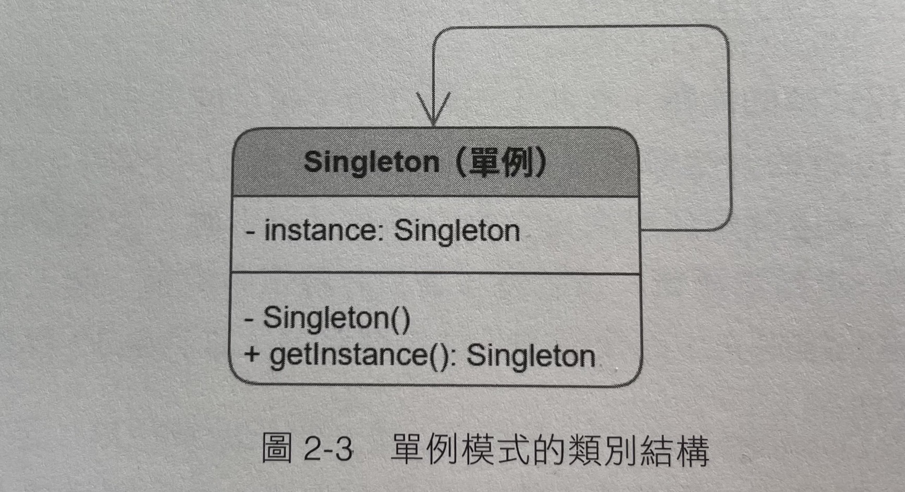

## Singleton 單例模式

- 無論是誰，呼叫幾次，取得的實例都是同一顆實例
  - 太陽是太陽系內唯一的恆星實例
  - 如果天上有九個太陽，那麼將會帶來一場災難

## 類別結構

- 注意建構函式必須宣告為 private 以避免外部呼叫建立新的太陽
- private instance 也只能透過 getInstance 方法來取得
- 單例模式的實作一般分為兩種實作方式
  - eager initialization
  - lazy initialization(double-checked locking)

## 餓漢模式 (Eager Initialization)
- 在初始階段就主動進行實例化
- 時刻保持一種渴求的狀態，無論此單例是否有人在使用
- 問題：如果始終沒人獲取日光，那豈不是白造了太陽

## 懶漢模式 (Lazy Initialization)
- 第一次取得實例時才建立實例
- 好處：如無請求就不會實例化，節省記憶體空間
- 壞處：第一次呼叫的速度會較慢(需要造日)
- 若有執行緒問題的考量，需要用 double-checked locking
  - 兩層 if (Sun == null) 為 double-check locking
  - 第一層 if 放寬入口，保證執行緒並行的高效性 (允許多執行緒同時進入此方法)
  - 第二層 if 與 lock 保證實例化的單次執行

## 結論
- 情境：需要建立一個系統中唯一的實例，不論由誰，取得幾次，都是取得同一個實例
- 建議：其實大多數情況下我們 通常會更多地使用「餓漢模式」，因為此實例遲早要被實例化佔用記憶體，延遲載入的意義並不大，加解鎖反而是一種資源浪費

## 其它參考資料

- [我的Notion筆記](https://iced-droplet-883.notion.site/Singleton-47144315e7db46aa8bbb81d01be11e30)
- 參考書籍 ([秒懂設計模式](https://www.books.com.tw/products/0010910659))